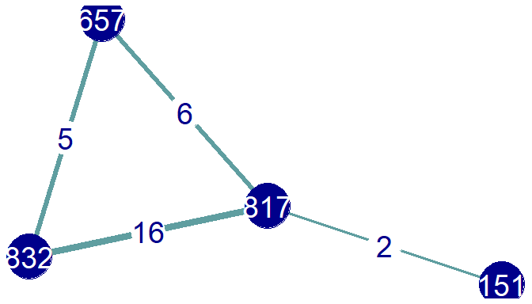

<!-- README.md is generated from README.Rmd. Please edit that file -->
twittnet
--------

Tools for mapping individual social networks on Twitter with R. All functions are built on functions from the excellent package [rtweet by Michael Kearney](https://github.com/mkearney/rtweet).

### Overview

These tools are designed to map out local ego networks for Twitter users. These are "1.5 ego" networks, meaning they include the user's connections to their contacts on Twitter, as well as connections among these contacts.

The tools focus on reciprocated relationships on Twitter, i.e. users who follow or mention each other. This makes more efficient use of the Twitter API's rate limit, and hopefully focuses on connections that are more likely to be meaningful.

For example, to create a map of who a user talks to, and whether these users also talk to each other within the last month:

``` r
map<- recip_mentioners_network(user="817544938623737858", startday=Sys.Date()-30)
```

We can visualize this network map with ggnet2: 

For a more detailed introduction to this type of network map, see the "Mentions mapping" vignette.

### Getting started

To install and view a beginner's guide to the package (the Mentions\_mapping vignette):

``` r
if (!requireNamespace("devtools", quietly = TRUE)) {
  install.packages("devtools")
}
devtools::install_github("llsigerson/twittnet")
library(twittnet)
RShowDoc("Mentions_mapping", package = "twittnet", type="html")
```

Since this package relies heavily on the rtweet package, it's recommended to have a a look at the [readme](https://github.com/mkearney/rtweet/blob/master/README.Rmd) for that package, which has a complete guide for getting access to Twitter data, and shows some of the other things you can do with rtweet.

For a quick setup, simply create a Twitter account, then load twittnet, which will automatically load rtweet as well. Then, run any rtweet function, such as lookup\_users(), and you'll be redirected to Twitter to authorize access via your Twitter account.

For a fuller introduction to tokens and Twitter data, check out the rtweet [vignette](https://github.com/mkearney/rtweet/blob/master/vignettes/auth.Rmd).

Some of twittnet's functions (especially recip\_mentioners\_network and recip\_followers\_network) can take a long time to complete. Beginners are recommended to set verbose=T to keep track of the function's progress. Also consider restricting the amount of data you collect, by setting a shorter time frame in the mentions maps, or setting a lower value for max.friends or max.followers in the followers maps.

### Some technical details

The two main types of ties are following and mentions. Following ties are dichotomous (two users are either connected or not). They probably represent more stable, long term relationships on Twitter. However, since no effort is required to maintain these relationships, and because of "follow for follow" practices on Twitter, as well as the ability to mute someone that you follow, there's a risk of these networks including meaningless connections. The functions in this repository that are used to map out reciprocated following ties are: recip\_followers and recipfollowers\_network.

Mention ties are based on reciprocated mentions of each other, which also include retweets and replies. These relationships require active maintenance, and users tend to have fewer of these connections. Since the API only allows access to a user's recent tweets, these ties are less stable. For example, replies between two users in a single thread could look like a very strong relationship, even if they never talk to each other again. The default for the recipmentioners function is to include all connections that have a minimum of two mentions in the last 30 days, but this is customizable. The functions in this repository that are used to map out reciprocated mentions ties are get\_tweets, get\_mentionees, recip\_mentioners, and recip\_mentioners\_network.

### Next steps for the package

Currently, this package is just the outgrowth of some tools that I made for my own research. I was encouraged to convert it to a package by some supportive members of the R community. I'd love to have input (at any level of expertise), and I'm particularly interested to see what would be helpful for others.
